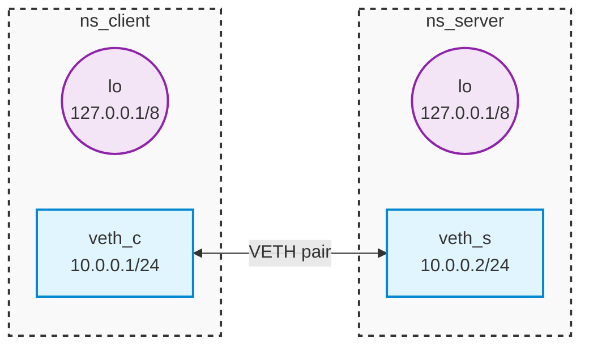
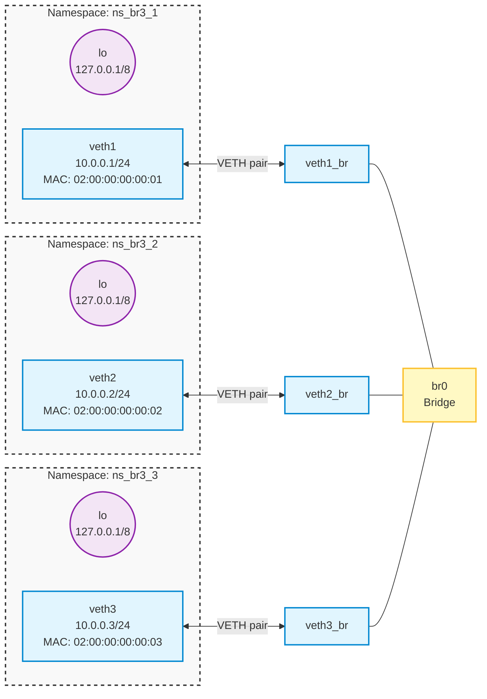

[View on GitHub]()

### Network interfaces

See what network interfaces you have:

```shell
ip address
ip a
```

Example output:

```text
[...]
2: wlp0s20f3: <BROADCAST,MULTICAST,UP,LOWER_UP> mtu 1500 qdisc noqueue state UP group default qlen 1000
    link/ether dc:21:5c:08:bf:83 brd ff:ff:ff:ff:ff:ff
    inet 192.168.178.28/24 brd 192.168.178.255 scope global dynamic noprefixroute wlp0s20f3
       valid_lft 863466sec preferred_lft 863466sec
    inet6 fe80::2ecb:209a:b7d2:bd77/64 scope link noprefixroute 
       valid_lft forever preferred_lft forever
[...]
```

Interface `wlp0s20f3` has MAC address `dc:21:5c:08:bf:83` and IP addresses `192.168.178.28` and `fe80::2ecb:209a:b7d2:bd77` assigned.

### Virtual network setup

Create isolated pair of virtual hosts with separate networking environment:

```shell
sudo ./direct_client_server.sh up
```
Source: [direct_client_server.sh]()

This is what we've constructed within a single operating system thanks to Linux powerful network virtualization features.



You can list virtual hosts (network namespaces) with:

```shell
ip netns ls
```

You can execute any command using `ip netns exec` to run it in one of the virtual environments:

```shell
sudo ip netns exec ns_client ip address
```

```shell
sudo ip netns exec ns_server ip address
```

You can clean that up with:

```shell
sudo ./direct_client_server.sh down
```

Note that regular host networking is kept completely separate.

### Netcat

Use `nc` to connect somewhere and send some data.

```shell
nc mini.pw.edu.pl 80 
```

We can even send some real requests:

```shell
echo -e "GET / HTTP/1.1\r\nHost: mini.pw.edu.pl\r\n\r\n" | nc mini.pw.edu.pl 80
```

Now let's establish both sides in our virtual environment:

```shell
sudo ip netns exec ns_server nc -l -p 80 -v
```

```shell
sudo ip netns exec ns_client nc 10.0.0.2 80 -v
```

ClosSource: [direct_client_server.sh]()
e client connection with `C-c`.

### Packet sniffing

Run the packet sniffer on the server side:

```shell
sudo ip netns exec ns_server tcpdump -i veth_s -n -w dump.pcap --print
```

```shell
sudo ip netns exec ns_server nc -l -p 80
```

```shell
sudo ip netns exec ns_client nc 10.0.0.2 80
```

### External traffic capture

Try dumping host communication:

```shell
sudo tcpdump -i $(ip route get 8.8.8.8 | grep -oP 'dev \K\S+') -n -w dump.pcap --print && \
wireshark dump.pcap
```

Here `ip route get` is used to get name of the interface handling internet traffic.

```shell
echo -ne "GET / HTTP/1.1\r\nHost: mini.pw.edu.pl\r\n\r\n" | nc mini.pw.edu.pl 80
```

Look into the dump in wireshark. Try filtering by `http`/`tcp` protocol to find our request.

Find and display first frame of the request in `tshark` CLI:

```shell
STREAM_ID=$(tshark -r dump.pcap -Y "http.request.method == GET" -T fields -e tcp.stream | head -n 1)
FRAME_NUM=$(tshark -r dump.pcap -Y "tcp.stream == $STREAM_ID" -T fields -e frame.number | head -n 1)
tshark -r dump.pcap -Y "frame.number == $FRAME_NUM" -x
```

Note `tshark` options used:
* `-Y` filters frames
* `http.request.method == GET` filter used to get ID of the first TCP connection stream associated with HTTP request
* `tcp.stream == $STREAM_ID` filter is used to get the first frame index of the request
* `-x` displays frame in hex

### Raw L2 frames

Start capturing and displaying in raw L2 format on the server side:

```shell
sudo ip netns exec ns_server tcpdump -i veth_s -XX -e -n
```

Send to broadcast address `ff:ff:ff:ff:ff:ff` from the client:

```shell
sudo ip netns exec ns_client ./send_eth.py -i veth_c -s '11:22:33:44:55:66' -d 'ff:ff:ff:ff:ff:ff' -p "Broadcast"
```
[send_eth.py]()

Note that `bind()` forces to use `veth_c` as outgoing interface.

Send to an _invalid_ `00:11:22:33:44:55` address:

```shell
sudo ip netns exec ns_client ./send_eth.py -i veth_c -s '11:22:33:44:55:66' -d '00:11:22:33:44:55' -p "Invalid DST"
```

Observe that a packet is still forwarded.
The sending OS does may not assume who is on the other end of `veth`.

### L2 bridge (virtual switches)

```shell
sudo ./bridge_3hosts.sh up
```
[bridge_3hosts.sh]()



Inspect MAC addresses of the virtual hosts:

```shell
MAC1=$(sudo ip netns exec ns_br3_1 cat /sys/class/net/veth1/address)
MAC2=$(sudo ip netns exec ns_br3_2 cat /sys/class/net/veth2/address)
MAC3=$(sudo ip netns exec ns_br3_3 cat /sys/class/net/veth3/address)
echo "NS1: $MAC1 | NS2: $MAC2 | NS3: $MAC3"
```

Observe what _switch_ knows about MACs:

```shell
watch -n0.1 'bridge fdb show br br0 | grep -v "permanent"'
```

Flush the FDB (forwarding database) table:

```shell
sudo bridge fdb flush dev br0
```

Sniff packets on hosts 2 & 3:

```shell
sudo ip netns exec ns_br3_2 tcpdump -i veth2 -XX -e -n
```

```shell
sudo ip netns exec ns_br3_3 tcpdump -i veth3 -XX -e -n
```

Try sending packets from host 1 with funny src/dst addresses:

```shell
sudo ip netns exec ns_br3_1 ./send_eth.py -i veth1 -s "aa:aa:aa:aa:aa:aa" -d "bb:bb:bb:bb:bb:bb" -p "<3"
```

Observe that:
- bridge memorizes source addresses
- bridge forwards packet everywhere

Now send some correct traffic:

```shell
sudo ip netns exec ns_br3_1 ./send_eth.py -i veth1 -s "02:00:00:00:00:01" -d "02:00:00:00:00:02" -p "Request"
```

```shell
sudo ip netns exec ns_br3_2 ./send_eth.py -i veth2 -s "02:00:00:00:00:02" -d "02:00:00:00:00:01" -p "Reply"
```

Observe that after bridge memorized some address, it forwards the packet to the correct host.

