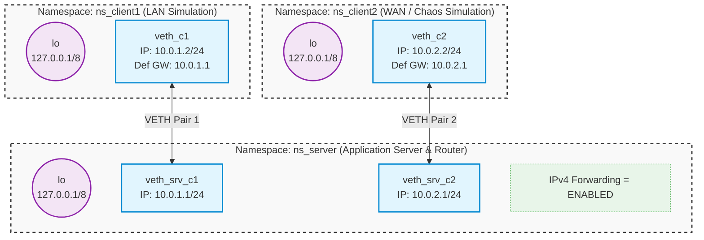

[View on GitHub]()

## Address conversions

See how to convert textual and binary IPv4 addresses back and forth:

```shell
make -B addrconv
```
[addrconv.c]()

```shell
./addrconv 192.168.1.100
./addrconv 127.0.0.1
./addrconv 256.0.0.1
./addrconv abrakadabra
```

## Binding addresses

```shell
make -B addrbind
```

Bind localhost address:

```shell
./addrbind 127.0.0.1 8080
```

Bind `INADDR_ANY`:

```shell
./addrbind 0.0.0.0 8080
```

Explicitly bind ephemeral port:

```shell
./addrbind 127.0.0.1 0
```

## User Datagram Protocol

### Setup

Set up server independently connected with two clients over two distinct networks:

```shell
sudo ./two_clients.sh up
```
[two_clients.sh]()



Namespace `ns_server` will act here both, as a routing device between networks `10.0.1.0/24` and`10.0.2.    0/24`
and as a node running the server application and receiving traffic.

Note clients have a default gateway configured to `10.0.1.1` and `10.0.2.1` respectively.

Verify connectivity:

```shell
sudo ip netns exec ns_client1 ping -c 2 10.0.1.1 # Client 1 <-> Server
```
```shell
sudo ip netns exec ns_client2 ping -c 2 10.0.2.1 # Client 2 <-> Server
```
```shell
sudo ip netns exec ns_client1 ping -c 2 10.0.2.2 # Client 1 <-> Client 2
```
```shell
sudo ip netns exec ns_client2 ping -c 2 10.0.1.2 # Client 2 <-> Client 1
```

---

### Basic Usage

```shell
make time_server time_client
```
[time_protocol.h]()
[time_server.c]()
[time_client.c]()

Run server bound on `INADDR_ANY:8080`:

```shell
sudo ip netns exec ns_server ./time_server 0.0.0.0 8080
```

And try to have it serve some requests:

```shell
sudo ip netns exec ns_client1 ./time_client 10.0.1.1 8080
```

```shell
sudo ip netns exec ns_client2 ./time_client 10.0.2.1 8080
```

Capture an incoming packet and inspect them:

```shell
sudo ip netns exec ns_server tcpdump -i veth_srv_c1 -n -c 1 -v -XX -w udp.pcap --print udp port 8080
```

```shell
tshark -r udp.pcap -V -x
```

### Binding specific interface

```shell
sudo ip netns exec ns_server ./time_server 10.0.1.1 8080
```

Observe that client 1 is handled as previously, client 2 requests are not processed.

Note packets from client 2 are reaching the server. The OS net stack drops them and generates back ICMP response:

```shell
sudo ip netns exec ns_server tcpdump -i veth_srv_c2 -n
```

Experiment with binding non-local adresses:

```shell
sudo ip netns exec ns_server ./time_server 10.0.3.1 8080
```

### Localhost communication

Try binding `lo` address:

```shell
sudo ip netns exec ns_server ./time_server 127.0.0.1 8080
```

```shell
sudo ip netns exec ns_server ./time_client 127.0.0.1 8080
```

Note `ns_server` used in **client** invocation. External communication won't in such a setup.

### Port choice

Try to run multiple servers in parallel and note `Address already in use` error:

```shell
sudo ip netns exec ns_server ./time_server 0.0.0.0 8080
```

You can easily check with `ss` (_socket statistics_) tool system-wide port usage:

```shell
sudo ip netns exec ns_server ss -aun
```

Try running server bound on 10.0.1.1 and 10.0.2.1 in parallel.

Note that in the host namespace, typically binding low ports (< 1024) is not allowed.

```shell
./time_server 127.0.0.1 999
```

In explicitly created namespaces there are no such restrictions.

### Packet loss

Inject random packet drops between server and client 2 simulating weak connection:

```shell
sudo ip netns exec ns_client2 tc qdisc add dev veth_c2 root netem loss 40%
```

Run the server as normal:

```shell
sudo ip netns exec ns_server ./time_server 0.0.0.0 8080
```

Observe client 1 running normally:

```shell
sudo ip netns exec ns_client1 ./time_client 10.0.1.1 8080
```

Check how client 1 behaves:

```shell
sudo ip netns exec ns_client2 ./time_client 10.0.2.1 8080
```

Never assume any single UDP packet gets delivered. **Always expect it to be lost!**

Rollback to the normal state:

```shell
sudo ip netns exec ns_client2 tc qdisc del dev veth_c2 root
```

### Reorderings

Build and try out client sending burst of requests:

```shell
make time_burst_client
```

```shell
sudo ip netns exec ns_client2 ./time_burst_client 10.0.2.1 8080
```

Now let's simulate another possible network behavior - packet reordering:

```shell
sudo ip netns exec ns_client2 tc qdisc add dev veth_c2 root netem delay 500ms 400ms distribution normal reorder 50%
```

Try running client 2 now and observe server and client logs.

**Never assume UDP datagram delivery order!**

Rollback to the normal state:

```shell
sudo ip netns exec ns_client2 tc qdisc del dev veth_c2 root
```
